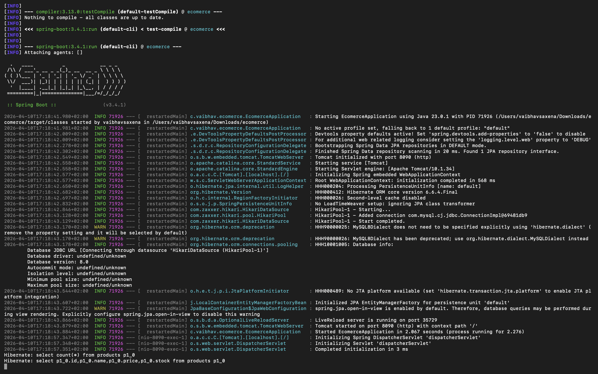
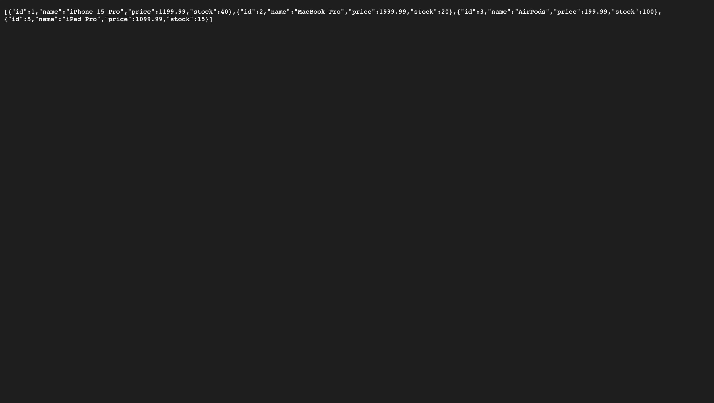

# Complete E-Commerce CRUD API 🚀

**Production-ready Spring Boot 3.4.1 + MySQL** - Full CRUD **LIVE**!

## 📋 API Endpoints (port 8090)
| Method | Endpoint | Description |
|--------|----------|-------------|
| `GET` | `/hello` | Backend health |
| `GET` | `/products` | List products |
| `POST` | `/products` | Create product |
| `PUT` | `/products/{id}` | Update product |
| `DELETE` | `/products/{id}` | Delete product |

## 🛠 Sample Data
```json
[{"id":1,"name":"iPhone 15 Pro","price":1199.99,"stock":40}]
```
## 🎬 Live Demo Screenshots

**Terminal (API running on port 8090):**


**Products API Response (MySQL data):**


## 🚀 Quick Start
```bash
git clone https://github.com/vaibhavsaxena/ecommerce-backend.git
cd ecommerce-backend
chmod +x mvnw
./mvnw spring-boot:run
```

## 🛠 Tech Stack
- Spring Boot 3.4.1
- MySQL 8.0
- Spring Data JPA
- Maven

## 📁 Structure

ecommerce-backend/
├── src/main/java/com/vaibhav/ecomerce/
│ ├── controller/HomeController.java
│ ├── model/Product.java
│ └── repository/ProductRepository.java
├── pom.xml
└── README.md


---
**Vaibhav Saxena** | Warsaw, PL | Apr 2026
